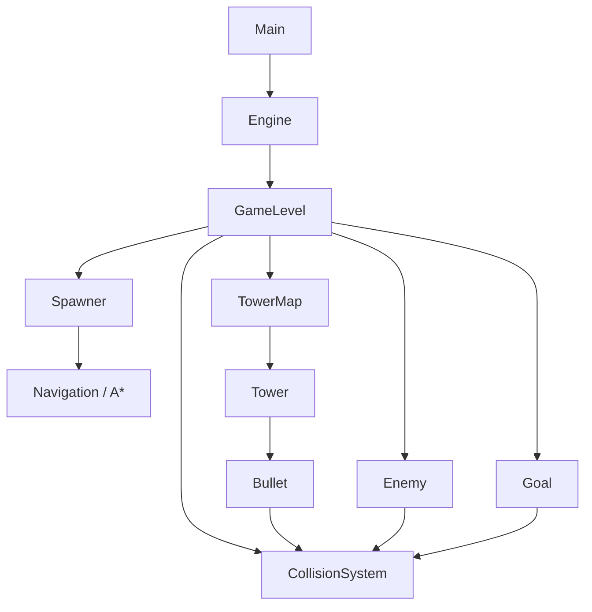
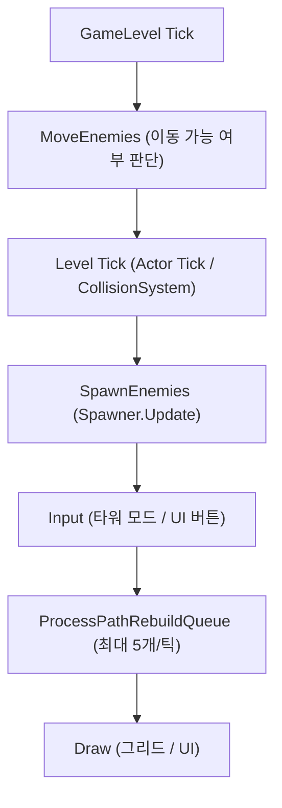

# ASCIIDefense

콘솔 환경에서 타워를 설치해 몰려오는 적을 막는 **타워 디펜스 게임**입니다.
**A\* 경로 탐색** 기반으로 적이 스폰 지점에서 목표 지점까지 이동하며, 라운드가 진행될수록 적의 체력과 생성 속도가 증가합니다.

> 📦 Release: https://github.com/yj9809/ASCIIDefense/releases

---

## Overview
- 직접 제작한 **콘솔 게임 엔진(Engine)** 위에서 동작하며, 렌더링·입력·충돌·컴포넌트 시스템을 엔진이 담당합니다.
- 맵 파일(`.txt`)을 파싱해 그리드 기반 스테이지를 구성합니다.
- 적은 **A\* 알고리즘**으로 경로를 계산하고, 타워 설치 시 실시간으로 경로를 재탐색합니다.
- 경로가 완전히 막히는 위치에는 타워를 설치할 수 없습니다.

---

## Key Features
- **텍스트 맵 로딩 (`.txt`)** 기반 스테이지 구성
- **A\* 경로 탐색** + 노이즈로 적마다 경로 다양화
- **타워 설치/제거** 시 영향받는 적 경로만 선별 재계산
- **타워 공격 업그레이드** 시스템 (골드 100 소모)
- **라운드 시스템** — 라운드마다 적 체력·생성 속도 증가
- **그리드 기반 충돌 회피** — 적끼리 같은 칸으로 겹치지 않도록 이동 처리
- **8방향 총알** — 방향에 맞는 문자(\ | / ─ 등)로 궤적 표현
- **디버그 모드** (`P`) — 모든 적의 남은 경로 시각화

---

## Controls
- `C`: 타워 배치 모드 토글
- `Left Click`: 타워 배치 / 라운드 시작 버튼 / 업그레이드 버튼
- `Right Click`: 타워 제거 (골드 10 환급)
- `P`: 경로 디버그 표시 토글

---

## How to Run
### Option A) Release 실행 (추천)
1. Releases에서 최신 버전 다운로드
2. 압축 해제 후 `ASCIIDefense.exe` 실행

### Option B) 소스 빌드
- IDE: Visual Studio 2022 / 2026
- Solution: `ASCIIDefense.slnx`
- Build: `x64 / Debug` 또는 `Release`
- 실행: 빌드 후 생성된 exe 실행

---

## Technical Highlights (What I solved)

### 1) 타워 설치 전 경로 유효성 검사
- **문제**: 타워를 설치했을 때 적이 목표까지 도달하는 경로가 존재하지 않는 경우 설치 자체가 불가능해야 함
- **해결**: `CanPlaceTowerAt()`에서 임시 그리드에 타워를 배치한 뒤 **A\*로 경로 존재 여부를 미리 검사** — 경로가 없으면 설치 거부

### 2) 타워 설치 후 경로 재계산 성능
- **문제**: 타워 설치 시 모든 적의 경로를 즉시 재계산하면 프레임 드랍 발생
- **해결**: 재계산이 필요한 적만 `pathRebuildQueue`에 삽입 후 **매 틱 최대 5개씩** 분산 처리. 영향 범위(설치된 3×3 셀과 기존 경로 교차 여부)로 대상 적 선별

### 3) 적끼리의 이동 충돌 처리
- **문제**: 같은 칸을 향해 여러 적이 동시에 이동하려 할 때 겹침 발생
- **해결**: 매 틱 목적지별로 그룹핑 후 **1명만 이동 허용**. 단, 두 적이 서로의 위치를 교환하는 **맞교환(swap)은 예외 허용**으로 교착 방지

### 4) A\* 경로 다양화
- **문제**: 모든 적이 동일한 최단 경로를 따라 이동해 단조로운 게임 흐름
- **해결**: 셀별 랜덤 `noise` 값을 휴리스틱에 더해 적마다 조금씩 다른 경로를 생성. Spawner에서 noise 범위 1.0~3.0, 재계산 시 0.0~2.5 사용

---

## Architecture

### 1) System Overview
- Engine이 게임 루프를 관리하고, GameLevel이 모든 Actor와 Spawner를 조율합니다.
- 충돌은 CollisionSystem이 처리하며, Bullet↔Enemy, Enemy↔Goal 간 충돌 이벤트로 연결됩니다.

### 2) Frame Pipeline
- GameLevel Tick에서 아래 순서로 업데이트됩니다.

### 3) Grid Value Reference

| 값 | 의미 |
|----|------|
| `0` | 빈 통로 |
| `1` | 벽 (`#`) |
| `2` | 타워 영역 |
| `5` | 스폰 지점 (`S`) |
| `6` | 목표 지점 (`G`) |
